# Estructura del proyecto Café Rewards

## Documento de referencia

Este documento presenta la estructura general del proyecto Café Rewards, organizada por carpetas principales y archivos de soporte. Su propósito es servir como referencia visual para documentación técnica, onboarding de desarrolladores o entrega de arquitectura básica.

## Estructura general

```mermaid
graph TD
    A[Proyecto: cafe_rewars] --> B[.git]
    A --> C[.gitignore]
    A --> D[.vscode]
    A --> E[docker-compose.yml]
    A --> F[backend]
    A --> G[docs]
    A --> H[frontend]

    F --> F1[.env]
    F --> F2[.gitignore]
    F --> F3[Dockerfile]
    F --> F4[limpiar.js]
    F --> F5[node_modules]
    F --> F6[package-lock.json]
    F --> F7[package.json]
    F --> F8[prisma]
    F --> F9[src]

    F8 --> F8A[schema.prisma]
    F8 --> F8B[migrations]

    F9 --> F9A[index.js]
    F9 --> F9B[prisma.js]
    F9 --> F9C[config]
    F9 --> F9D[controllers]
    F9 --> F9E[routes]
    F9 --> F9F[services]
    F9 --> F9G[utils]

    F9C --> F9C1[dotenv.js]

    F9D --> F9D1[campanaController.js]
    F9D --> F9D2[clienteController.js]
    F9D --> F9D3[productoController.js]

    F9E --> F9E1[authRoutes.js]
    F9E --> F9E2[baristaRoutes.js]
    F9E --> F9E3[clienteRoutes.js]

    F9F --> F9F1[correoService.js]
    F9F --> F9F2[plantillasCorreo.js]

    G --> G1[Spect.md]
    G --> G2[structure.html]
    G --> G3[structure.mmd]
    G --> G4[structure.svg]
    G --> G5[structure_generated.svg]

    H --> H1[admin.js]
    H --> H2[barista.html]
    H --> H3[barista.js]
    H --> H4[cliente.html]
    H --> H5[cliente.js]
    H --> H6[index.html]
    H --> H7[login.html]
    H --> H8[login.js]
    H --> H9[logo.png]
    H --> H10[reglas_desarrollo.md]
    H --> H11[style.css]
```

## Notas

- El backend centraliza la lógica de API y acceso a datos.
- El frontend contiene las vistas web para cliente, login y administración.
- La carpeta docs almacena documentación y recursos de estructura del proyecto.

## Uso recomendado

Este contenido puede copiarse a un documento Markdown y exportarse luego a PDF para entregas formales o presentaciones técnicas.
